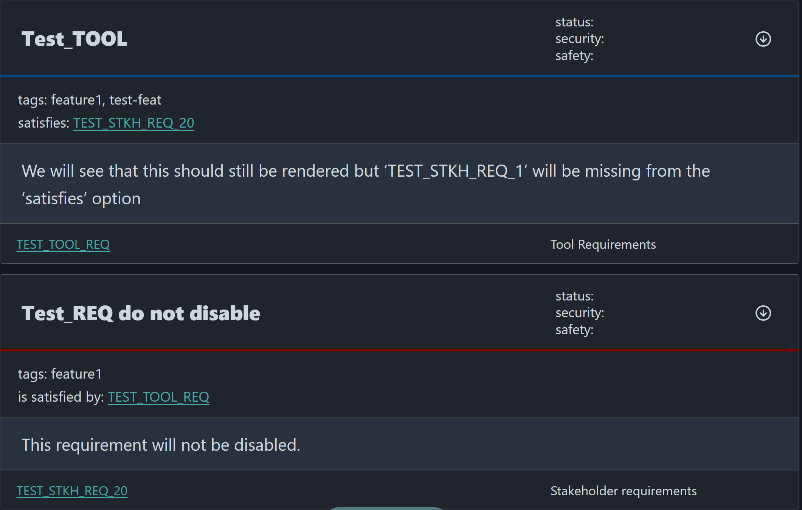

# Modularity Sphinx Extension

A Sphinx extension that enables conditional documentation rendering based on feature flags.

## Overview

The extension consists of two main components:

1. `feature_flags.bzl`: A Bazel translation layer that converts commands into tags
2. `modularity`: A Sphinx extension that filters documentation based on feature flags

It currently functions as a blacklist.  
**The extension is setup so it only disables requirements where *all* tags are contained within the filtered ones.**  

## Usage

### Command Line

Disable features when building documentation:

```bash
docs build //docs:docs --//docs:feature1=true
```

## Configuration

### Feature Flags (feature_flags.bzl)

The `feature_flags.bzl` file takes care of the following things:

- Feature-to-tag translation
- Feature name to flag mappings
- Default values for flags
- Temporary file generation for flag storage

Example configuration:

Mapping of features to tags is defined as follows:

```bzl
FEATURE_TAG_MAPPING = {
    "feature1": ["some-ip", "tag2"], # --//docs:feature1=true -> will expand to 'some-ip', 'tag2'
    "second-feature": ["test-feat", "tag6"],
}
```

The default values are defined like such: 
```bzl
def define_feature_flags(name):
    bool_flag(
        name = "feature1",
        build_setting_default = False,
    )
    bool_flag(
        name = "second-feature",
        build_setting_default = False,
    )
    
    feature_flag_translator(
        name = name,
        flags = {":feature1": "True", ":second-feature": "True"},
    )
```
As can be seen here, each flag needs to be registered as well as have a default value defined. 
After adding new flags it's possible to call them via the `--//docs:<flag-name>=<value>` command

The `feature_flag.bzl` file will after parsing the flags and translating them write a temporary file with all to be disabled tags.

### Extension (modularity)

The extension processes the temporary flag file and disables documentation sections tagged with disabled features.

#### Use in requirements

All requirements which tags are **all** contained within the tags that we look for, will be disabled.  
Here an eaxmple to illustrate the point.  
We will disable the `test-feat` tag via feature flags. If we take the following example rst:
```rst
.. tool_req::  Test_TOOL
    :id: TEST_TOOL_REQ
    :tags: feature1, test-feat 
    :satisfies: TEST_STKH_REQ_1, TEST_STKH_REQ_20
  
    We will see that this should still be rendered but 'TEST_STKH_REQ_1' will be missing from the 'satisfies' option

.. stkh_req:: Test_REQ disable
   :id: TEST_STKH_REQ_1
   :tags: test-feat
   
   This is a requirement that we would want to disable via the feature flag

.. stkh_req:: Test_REQ do not disable
   :id: TEST_STKH_REQ_20
   :tags: feature1

   This requirement will not be disabled.
```
We can then build it with our feature flag enabled via `bazel build //docs:docs --//docs:second-feature=true` 
This will expand via our translation layer `feature_flag.bzl` into the tags `test-feat` and `tag5`.  

**The extension is setup so it only disables requirements where *all* tags are contained within the filtered ones.**  
In the rst above `TEST_TOOL_REQ` has the `test-feat` tag but it also has the `feature1` tag, therefore it wont be disabled.
In contrast, TEST_STKH_REQ_20 has only the `test-feat` tag, therefore it will be disabled and removed from any links as well.

If we now look at the rendered HTML:


We can confirm that the `TEST_STKH_REQ_1` requirement is gone and so is the reference to it from `TEST_TOOL_REQ`. 


*However, keep in mind that in the source code the actual underlying RST has not changed, it's just the HTML.*  
This means that one can still see all the requirements there and also if searching for it will still find the document where it is mentioned. 


### How the extension achieves this? 

The extension uses a sphinx-needs buildin option called `hide`. If a need has the `hide=True` it will not be shown in the final HTML.  
It also gatheres a list of all 'hidden' requirements as it then in a second iteration removes these from any of the possible links.

